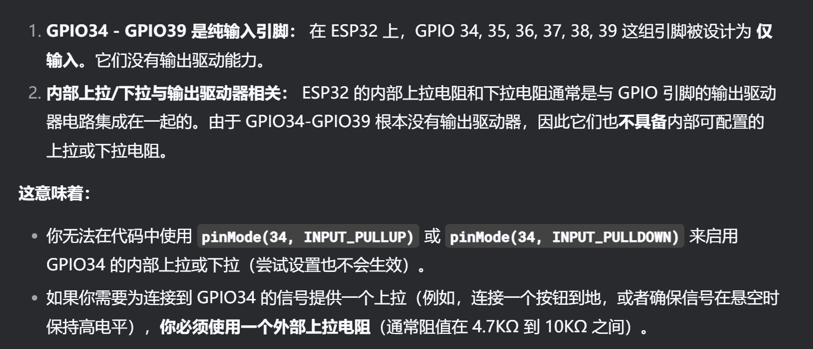
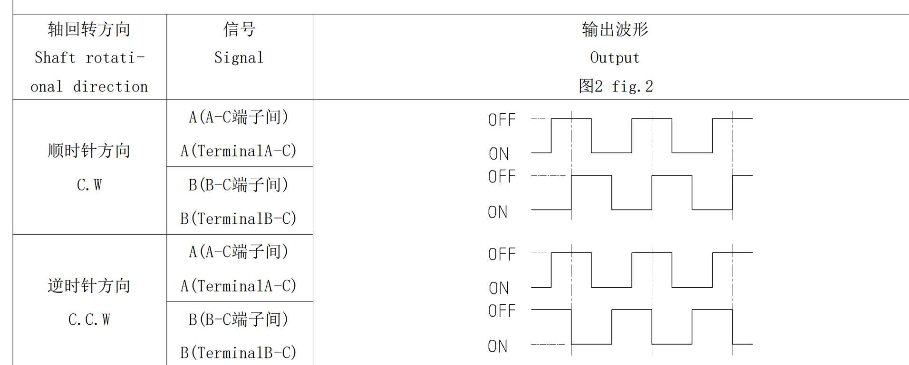

# Figure_display_case
## 文件介绍

1.oled_test：仅显示ui和其它一些小功能

2.controller_test：手柄和ui全功能

3.hardware：硬件，有bug暂不开了，后续完善再开，可以随便找个开发板也能用

## 开发环境：
见https://github.com/xiaocainiao11111/ESP32_connect_XboxController
  ## 知识点
  #### ESP32的奇妙io

   #### 旋转编码器用法
   需要两个状态一起判断

#### 屏幕库：
U8G2 + WouoUI，见参考工程

#### ui学习

**看代码注释吧**

  u8g2.drawRBox（绘制填充的圆角矩形）

x, y: 矩形左上角的坐标
   w, h: 矩形的宽度和高度
   r: 圆角的半径

drawRBox是填充的实心矩形，drawRFrame是空心的矩形框

u8g2.drawPixel画点
u8g2.drawVLine画线
u8g2.drawStr画文本

实际上都是在填充缓存区

std::ceil(x)
返回一个浮点值，表示不小于`x`的最小整数

long map(long x, long in_min, long in_max, long out_min, long out_max)
将一个数从一个范围线性映射到另一个范围

u8g2的缓存及瓦片机制。。。。。。

>select_ui_show变化：
>
>line_y:1  line_y_trg:1  box_y:0  box_y_trg:0  y:0  y_trg:0  
>
>line_y:4  line_y_trg:10  box_y:4  box_y_trg:16  y:0  y_trg:0  
>
>line_y:7  line_y_trg:10  box_y:8  box_y_trg:16  y:0  y_trg:0
>
>line_y:10  line_y_trg:10  box_y:12  box_y_trg:16  y:0  y_trg:0
>
>line_y:10  line_y_trg:10  box_y:16  box_y_trg:16  y:0  y_trg:0  

#### 动画相关
关于非线性平滑动画。。。。

关于非阻塞的线性动画。。。。

## 注意

1、烧录要按住拨轮
2、u8g2库连接屏幕失败的话会堵塞线程，不接屏幕调试时要注释掉OLED任务，不然会卡死

## 后续计划

触摸
灯条
小程序
换屏幕

## 参考工程：

<https://gitee.com/wenzhengclub/super_knob>

<https://github.com/xiaocainiao11111/ESP32_connect_XboxController>

<https://github.com/unlir/XDrive>

<https://github.com/peng-zhihui/Peak>

<https://github.com/FASTSHIFT/X-TRACK>

<https://github.com/RQNG/WouoUI>
